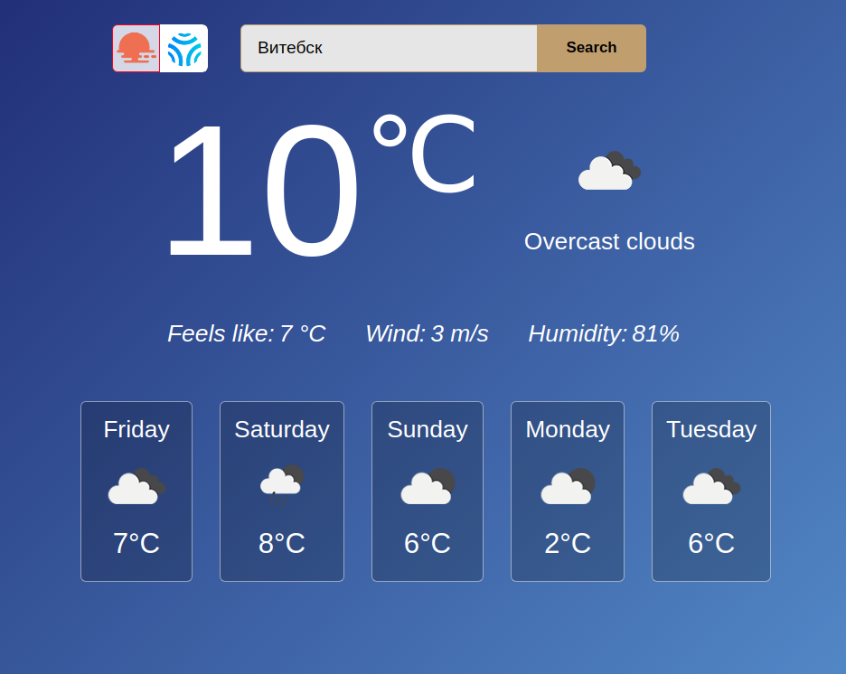

# React Weather


## [Live demo](https://kea-weather-react-app.netlify.app/)

## Description

The application is implemented using React, Redux, Redux-Saga and other libraries. Has a choice of two services for getting weather: Openweathermap and Climacell. Receives weather data for the current day, as well as a forecast for 5 days.

## How to use

- To determine the current location of the user, you must allow access to geolocation in the browser.
- To search for weather in other cities, you must enter the name of the city in the search field in Russian or English and click the "Search" button.



## Project setup

```
npm install
npm start
```

## For the future

Other weather services can be added.
